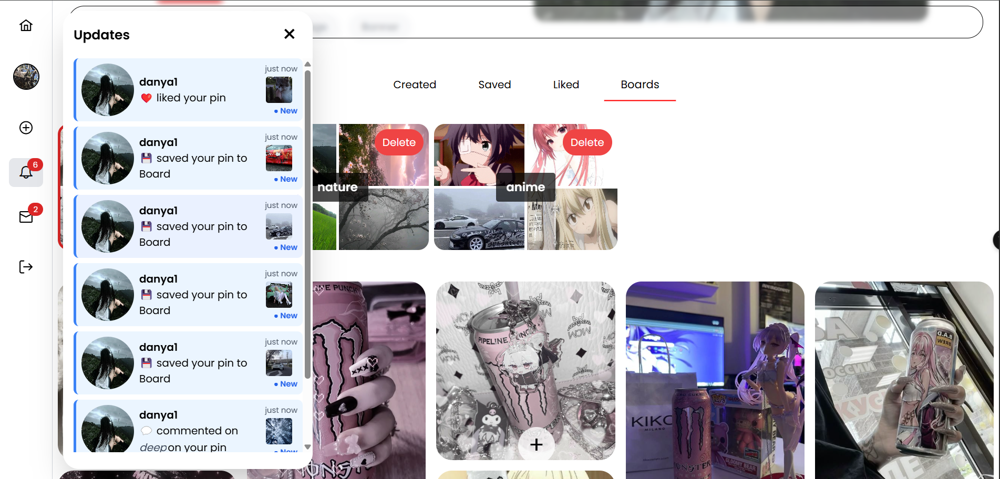
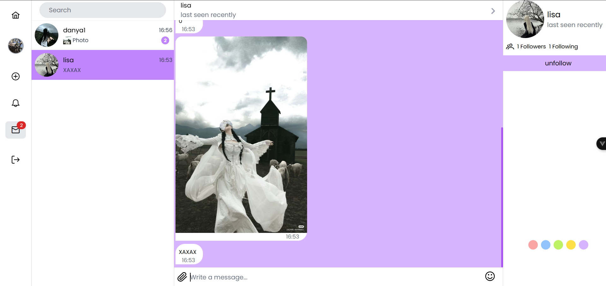
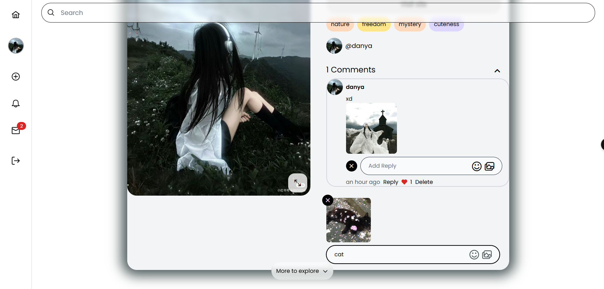
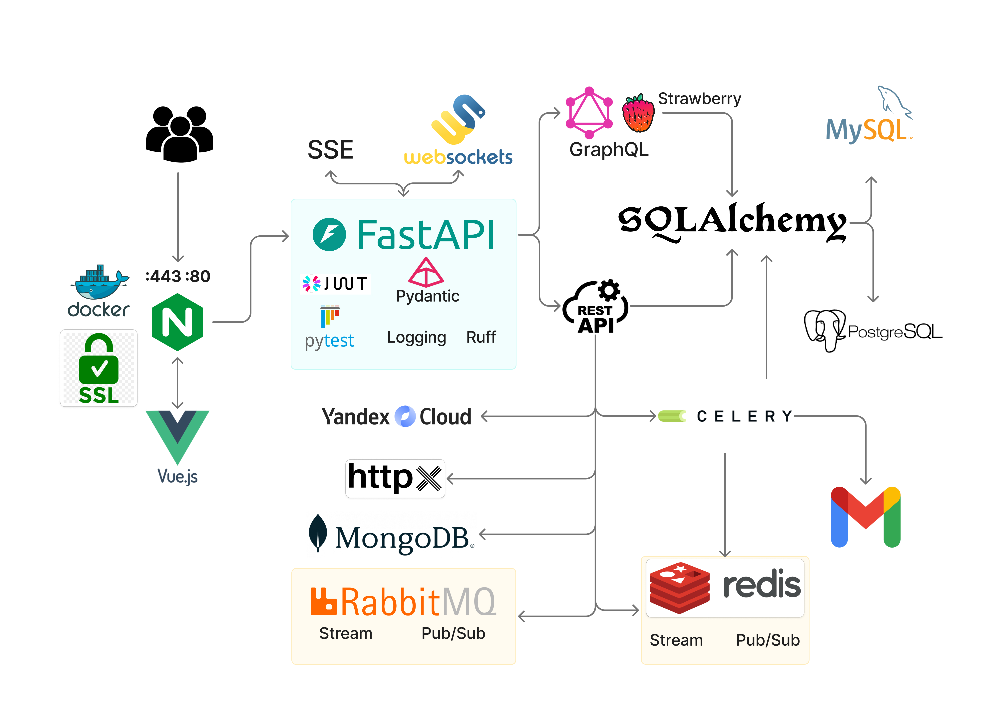

  
  <h1> 
    Pinterest Clone
  </h1>
  <h3> 
    1536 × 864 / Vue 3 & FastAPI
  </h3>

  <a href="https://pint3rest.xyz" target="_blank" rel="noopener noreferrer" style="margin: 0 20px; font-size: 1.4em; font-weight: bold; color: #8E44AD; text-decoration: none; transition: color 0.3s ease, transform 0.3s ease;">
    🌐 Explore Pinterest
  </a>
  
Quick try with test account and get started!

  <a href="https://pint3rest.xyz/api/docs" target="_blank" rel="noopener noreferrer" style="margin: 0 20px; font-size: 1.3em; font-weight: bold; color: #8E44AD; text-decoration: none; transition: color 0.3s ease;">
    📚 API Docs
  </a>
  <a href="https://pint3rest.xyz/api/graphql" target="_blank" rel="noopener noreferrer" style="margin: 0 20px; font-size: 1.3em; font-weight: bold; color: #8E44AD; text-decoration: none; transition: color 0.3s ease;">
    🔥 GraphQL API
  </a>
  <a href="https://pint3rest.xyz/api/openapi.json" target="_blank" rel="noopener noreferrer" style="margin: 0 20px; font-size: 1.3em; font-weight: bold; color: #8E44AD; text-decoration: none; transition: color 0.3s ease;">
    📄 OpenAPI JSON
  </a>
  <a href="https://pint3rest.xyz/api/redoc" target="_blank" rel="noopener noreferrer" style="margin: 0 20px; font-size: 1.3em; font-weight: bold; color: #8E44AD; text-decoration: none; transition: color 0.3s ease;">
    📖 ReDoc
  </a>

## 🔥 Features at a Glance

- 🖼️ Masonry grid feed with infinite scroll  
- 🔍 Search by query and tags  
- 📌 Detailed pins with comments, likes, related pins  
- 📝 Create/edit pins and boards  
- 👤 User profiles with followers/following  
- 💬 Real-time chat & notifications  
- 📡 SSE & WebSocket-powered updates  
- 🧠 Smart recommendations based on user activity  
- 🔐 JWT & Google OAuth2  
- ⚙️ REST & GraphQL APIs  
- 📦 Dockerized with GitLab CI/CD
- 🌐 Nginx Reverse Proxy/Security/Optimization

## 🎯 Use Cases

- Build your own image-sharing platform
- Learn modern full-stack development with Vue + FastAPI
- Use the project as a boilerplate for social media apps
- Practice advanced CI/CD & real-time data techniques

## 📽 Overview

🎬 **[Watch the demo video on YouTube](https://youtu.be/3NwWrd8uvFQ)**

### 🌸 Feed
#### The feed is the main page featuring search and tags, displaying pins in the form of gifs, videos, and images. It shows users who have posted these pins. The layout follows a masonry grid design with infinite scrolling.

  

### 📌 Pin + Related  
#### A detailed pin with title, description, href, tags, and the user who created it. Includes comments and likes. Below the pin, related pins are displayed based on connected tags.

  

### 🔍 Search
#### Pin search by query and tags, with a quick search feature available on any page. It also displays popular pins and a list of recent searches.

  

### ✨ New Pin
#### Pin creation — image/gif/video, with the option to add additional information to the pin and assign tags to it.

  

### 👤 User Profile  
#### User profile — profile editing by the owner, creation of boards, viewing/editing created/liked/saved pins, viewing/editing pins on boards. Users can also follow/unfollow and message other users.

  

### 👥 Followers/Following
#### View followers/following for any user.

  

### 🧷 Boards
#### Users create boards and add/remove pins on them

  

### ⭐ Recommendations
#### Users receive real-time recommendations based on their recently viewed pins.

  

### 🔔 Realtime Updates
#### Users receive real-time updates from others when their pins are saved, commented on, or liked.

  

### 💬 Chats
#### By messaging another user, you create a chat where you can exchange messages and media in real time. Chats can be customized in terms of size and color. You can also see which users are online on the site or in the chat.

  

### 💬🔔 Chats Updates
#### On any page, you receive real-time updates about new messages from other users.

  

### 📝❤️ Comments/Likes
#### You can comment on, like, and save a pin, as well as comment on and like other comments.

  

## Project Architecture

## 🛠️ Technologies Used

### 🧩 Backend  
- **FastAPI** – REST & GraphQL API  
- **SQLAlchemy** – ORM for database interactions  
- **Pydantic** – data validation & environment management  
- **JWT** – access/refresh tokens with revocation support  
- **OAuth2** – Google authentication  
- **httpx** – interaction with external APIs  
- **FastAPI-Cache** – API-level caching  
- **FastAPI-Mail** – sending emails via FastAPI  
- **GraphQL (Strawberry)** – GraphQL API layer  

### 🗄 Databases  
- **PostgreSQL**, **MySQL**, **MongoDB** – relational & non-relational databases  
- **Redis** – caching, token revocation, Celery broker/results, RedBeat  

### ⏱ Async Tasks & Realtime  
- **Celery** – async tasks: email sending, image processing  
- **Celery Beat** – periodic tasks (e.g., promo emails)  
- **Redis Stream** – message transport between Celery and FastAPI  
- **WebSockets** – real-time chat with `FastAPI.websockets`  
- **SSE (Server-Sent Events)** – real-time notifications  
- **Asyncio**, **Aiofiles** – asynchronous operations  

### 🧪 Testing & Code Quality  
- **Pytest** – testing framework  
- **Ruff** – linting & formatting  
- **Alembic** – database migrations  

### 📦 Deployment  
- **Docker**, **Docker Compose** – containerization & orchestration  
- **Nginx** – reverse proxy with API & WebSocket routing  
- **SSL** – secure HTTPS  
- **VPS** – deployment on virtual server  
- **GitLab CI/CD** – automated build, lint, test, deploy pipeline  
- **Yandex S3** – media file storage (Yandex Object Storage)

### 🎨 Frontend  
- **Vue 3** – modern JavaScript frontend framework  
- **Pinia** – state management  
- **Vue Router** – routing  
- **Tailwind CSS** – utility-first CSS framework  
- **Axios** – HTTP client  

## ⚙️ CI/CD Pipeline

This project uses **GitLab CI/CD** to automate the entire delivery process. The pipeline includes the following stages:

- 🧮 **Check Disk Space**  
  Before anything starts, it checks available disk space. If it's less than **3 GB**, it automatically runs `docker system prune` to free space.

- 🐳 **Docker Build**  
  Builds separate Docker images for:
  - **FastAPI** backend (`Dockerfile-fastapi`)
  - **Vue 3** frontend (`Dockerfile-vuejs`)

- ✅ **Lint & Format**  
  - Runs `ruff check` to detect linting issues.
  - Runs `ruff format --check` to ensure formatting consistency.

- 🛠️ **Database Migrations**  
  - Applies **PostgreSQL migrations** via `alembic upgrade head`.
  - Initializes **MySQL database** via custom script (`app.mysql.init_db`).

- 🧪 **Testing**  
  Runs `pytest` inside a container.

- 🚀 **Deploy**  
  Uses `docker-compose up -d` to start all services after successful testing.

🔒 **Secrets & Env Handling:**  
Before any job runs, the pipeline copies environment variables from a predefined `${ENV}` file and exports them for the scripts.

You can view the complete CI/CD configuration in [`.gitlab-ci.yml`](.gitlab-ci.yml).

## Discussion  
Have suggestions or improvements for the project? Feel free to discuss them in the [Discussion section](https://github.com/shutsuensha/pinterest-clone-vue3-fastapi/discussions)!

## License 
MIT License – free to use & share!

## Contacts

Feel free to reach out if you have any questions, suggestions, or collaboration ideas:

- Email: [dankupr21@gmail.com](mailto:dankupr21@gmail.com)
- Telegram: [@evalshine](https://t.me/evalshine)
- Linkedin: [daniil-kupryianchyk](https://www.linkedin.com/in/daniil-kupryianchyk-960594322)
