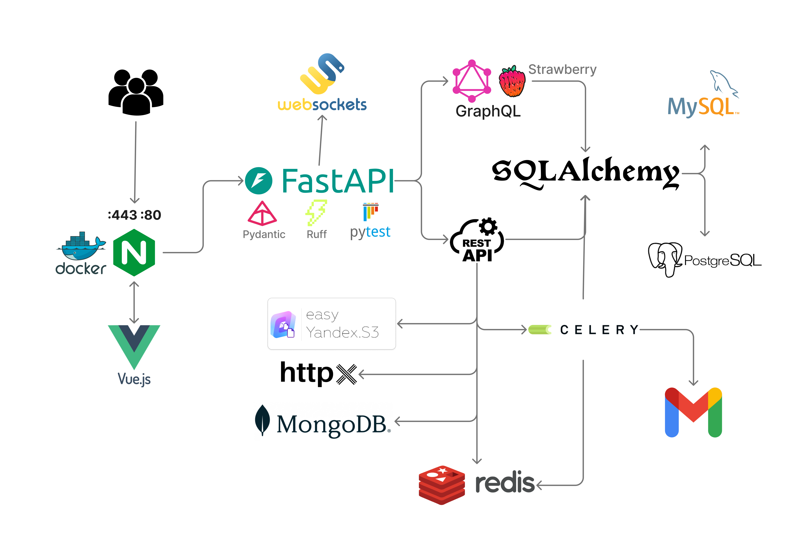

<div align="center">
  <h1> 
    <a href="https://pint3rest.xyz" target="_blank" rel="noopener noreferrer" style="margin: 0 15px; font-size: 1.2em; font-weight: bold; color: #8E44AD; text-decoration: none;">
      🌐 Pint3rest 🚀✨
    </a>
  </h1>
</div>

<div align="center">
  <a href="https://pint3rest.xyz/api/docs" target="_blank" rel="noopener noreferrer" style="margin: 0 15px; font-size: 1.2em; font-weight: bold; color: #8E44AD; text-decoration: none;">
    📚 API Docs
  </a>
  <a href="https://pint3rest.xyz/api/graphql" target="_blank" rel="noopener noreferrer" style="margin: 0 15px; font-size: 1.2em; font-weight: bold; color: #8E44AD; text-decoration: none;">
    🔥 GraphQL API
  </a>
</div>

<div align="center">
  <p><strong>Pint3rest</strong> is your fun space to share art & ideas! 🎨📸💡<br>
  Fast, cool, and creative! 😎✨</p>
</div>

<div align="center">
  <h2>👤 Users  📌 Pins  ❤️ Likes  💬 Comments  💭 Chats</h2>
</div>

<div align="center">
  <h2>⭐ Show Your Support 💖</h2>
  <p>Love it? Smash that <strong>⭐ on GitHub</strong>! 👍🎉</p>
</div>


## 📊 Project Architecture


---

## 🔑 Main Features

- **Users:**  
  Registration, login, logout, email verification, password reset, JWT authentication (access/refresh tokens), JWT token revocation, image upload, profile update, view all user profiles.

- **Pins:**  
  Creation, deletion, saving, pin liking, search, media upload, management of saves, likes, and created pins, view all pins, view an individual pin + related.

- **Tags:**  
  Tag management, search for pins by tags.

- **Comments:**  
  Adding comments to a pin, replies to comments, media upload, view comments on a pin.

- **Likes:**  
  Likes for pins and comments.

- **Subscriptions:**  
  Subscription management, retrieval of subscribers and subscriptions.

- **Chats and Messages:**  
  View chats, view chat history, send messages.

---

## 🛠️ Used Technologies

- **FastAPI:** REST and GraphQL API.
- **FastAPI-Cache:** For API-level caching.
- **FastAPI-Mail:** For sending emails via FastAPI.
- **SQLAlchemy:** ORM for working with databases.
- **Pydantic:** For validating requests/responses and **pydantic-settings** for managing environment variables.
- **JWT:** Access/refresh tokens, token revocation.
- **OAuth2:** Google Auth.
- **PostgreSQL, MySQL, MongoDB:** For working with relational and non-relational databases.
- **Redis:** For caching data, token revocation, acting as a broker, retrieving Celery results, and for Celery RedBeat.
- **Celery:** For sending verification/reset password emails, processing images (saving, resizing, updating the database).
- **Celery Beat:** For sending email advertisements.
- **Docker:** For containerizing applications.
- **Docker Compose:** For managing multi-container applications.
- **Nginx:** For proxying requests (`/api`, `/ws`) and ensuring security.
- **SSL:** For secure connections via HTTPS.
- **VPS:** For hosting the application on a virtual server.
- **Yandex S3:** For storing and retrieving files (Yandex bucket).
- **httpx:** For interacting with external APIs.
- **Websockets:** Implementation of chats using FastAPI.websockets.
- **SSE (Server-Sent Events):** For receiving notifications from the server on the client in real time.
- **Asyncio:** For asynchronous programming.
- **Aiofiles:** For asynchronous file system operations.
- **Logging:** For application logging.
- **Pytest:** For testing and ensuring code quality.
- **Ruff:** Linting and formatting.
- **Alembic:** For database migrations.
- **GitLab CI/CD:** For setting up a CI/CD pipeline (build, lint/format, migrations, test, deploy).
- **GraphQL (Strawberry):** For building a GraphQL API.


## ▶️ How to Run the Project

Follow these steps to set up and run the project locally.

- setup postgresql, redis locally
- copy `.env.example` to `.env` and update it with your settings.  
- python -m venv .venv  
- source .venv/bin/activate  
- pip install -r requirements.txt  

### Run FastAPI

```bash
uvicorn app.main:app --reload
```

### Run Vuejs
```bash
cd vuejs 
npm install
npm run dev
```

### Celery - Worker, Beat
```bash
celery -A app.celery.celery_app.celery_instance worker --loglevel=info  
celery -A app.celery.celery_app.celery_instance beat --loglevel=info  
```

## 🤝 Contribute 🤩
Got ideas? Report bugs, add features, or just join the fun! 🛠️💬

## 📜 License 📝
MIT License – free to use & share! 🔓

## 📬 Contact 📞
- 📧 [dankupr21@gmail.com](mailto:dankupr21@gmail.com)
- 💬 <a href="https://t.me/evalshine" target="_blank" rel="noopener noreferrer">Telegram @evalshine</a>
- 🐙 <a href="https://github.com/shutsuensha" target="_blank" rel="noopener noreferrer">GitHub shutsuensha</a>
