

  <h1> 
    <a href="https://pint3rest.xyz" target="_blank" rel="noopener noreferrer" style="margin: 0 15px; font-size: 1.2em; font-weight: bold; color: #8E44AD; text-decoration: none;">
      🌐 Pint3rest 🚀✨
    </a>
  </h1>

  <a href="https://pint3rest.xyz/api/docs" target="_blank" rel="noopener noreferrer" style="margin: 0 15px; font-size: 1.2em; font-weight: bold; color: #8E44AD; text-decoration: none;">
    📚 API Docs
  </a>
  <a href="https://pint3rest.xyz/api/graphql" target="_blank" rel="noopener noreferrer" style="margin: 0 15px; font-size: 1.2em; font-weight: bold; color: #8E44AD; text-decoration: none;">
    🔥 GraphQL API
  </a>

  
<strong>Pint3rest</strong> is your fun space to share art & ideas! 🎨📸💡 
  Fast, cool, and creative! 😎✨

  <h2>👤 Users  📌 Pins  ❤️ Likes  💬 Comments  💭 Chats</h2>

  <h2>⭐ Show Your Support 💖</h2>
  
Love it? Smash that <strong>⭐ on GitHub</strong>! 👍🎉

## 📊 Project Architecture
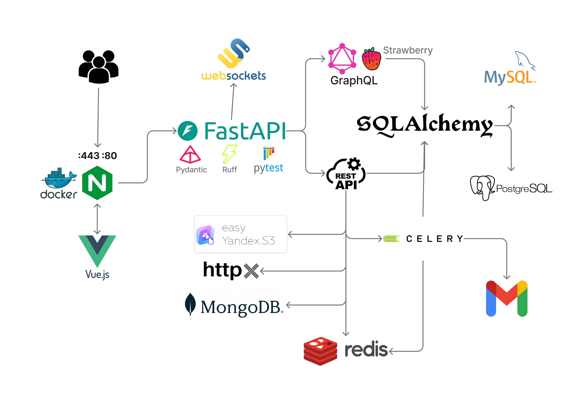

## 📸 Pint3rest vs Pinterest  

### 🏠 Home  

  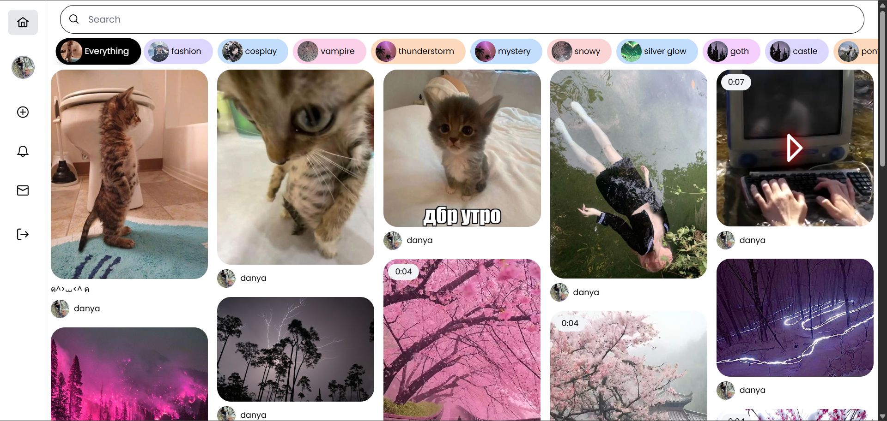
  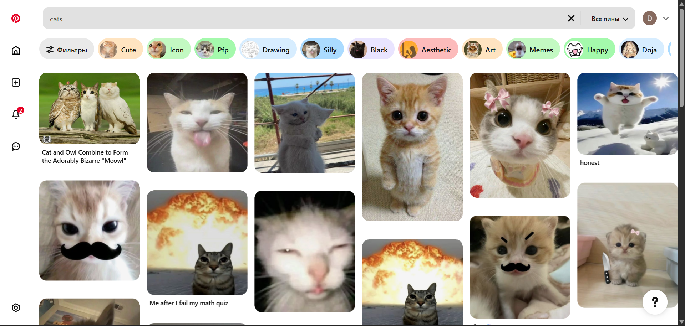

### 📌 Detail Page  

  
  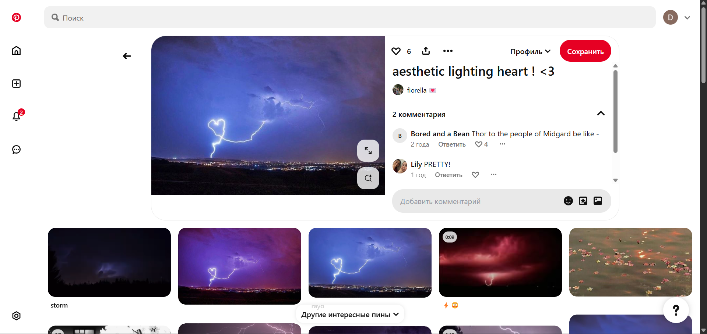

### ➕ Create  

  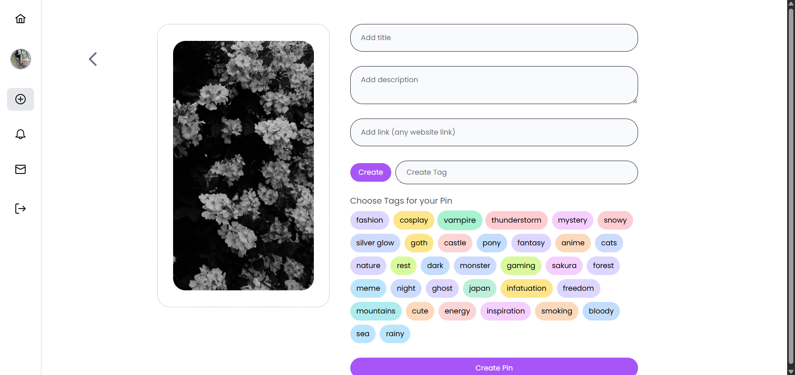
  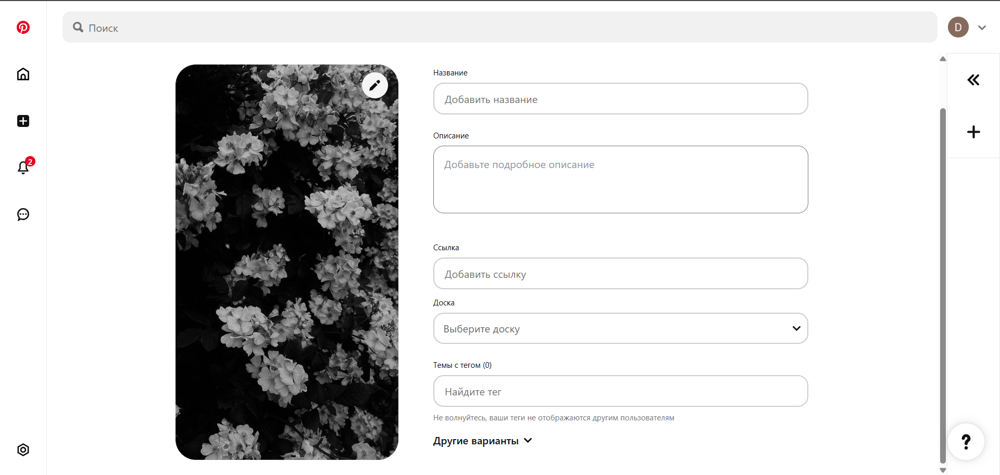

### 👤 User Profile  

  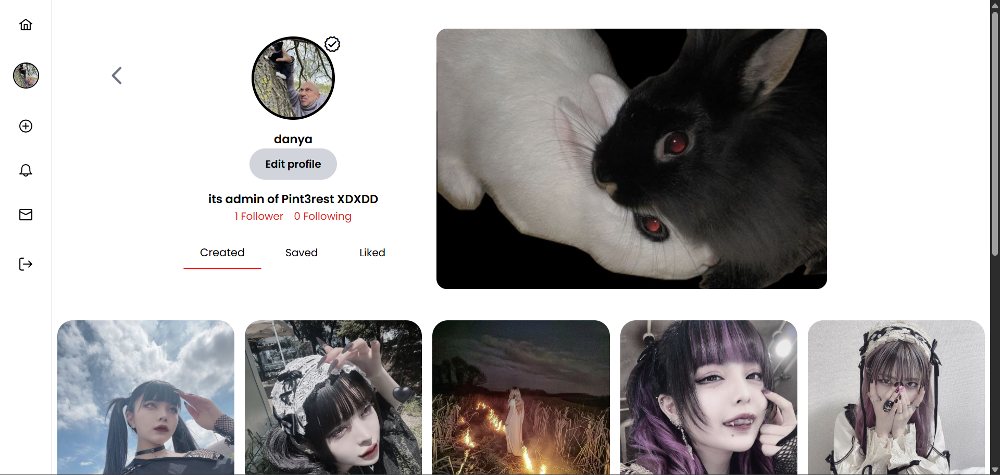
  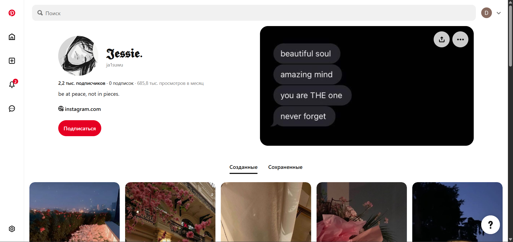

### 💬 Chats  

  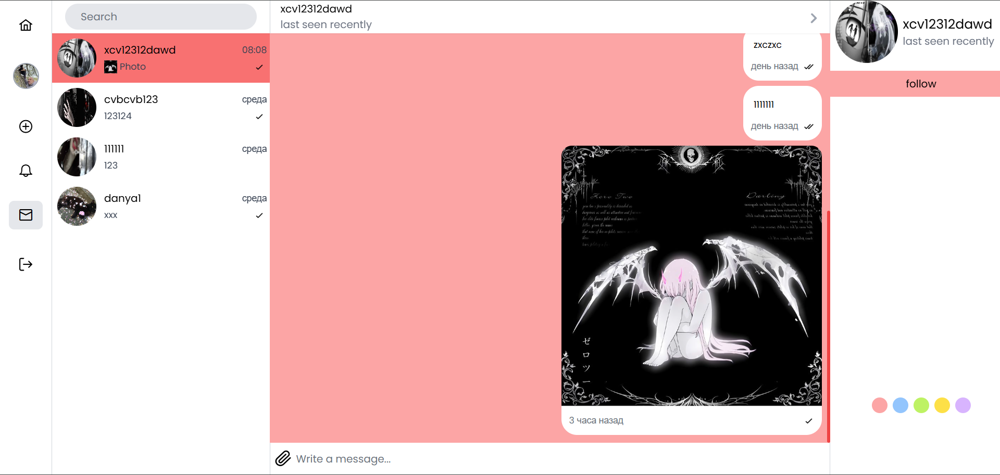
  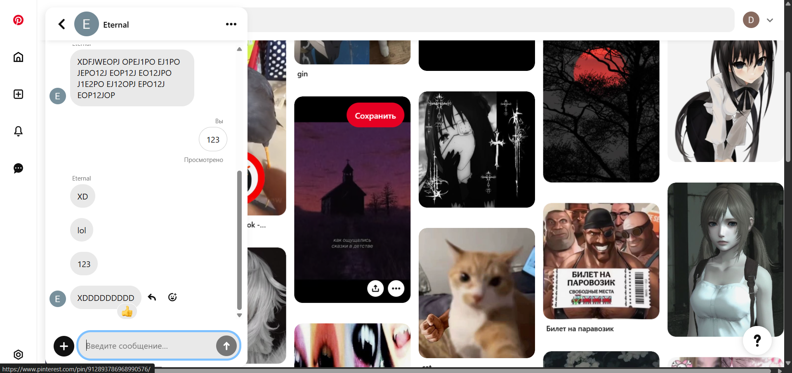

### 🔎 Search  

  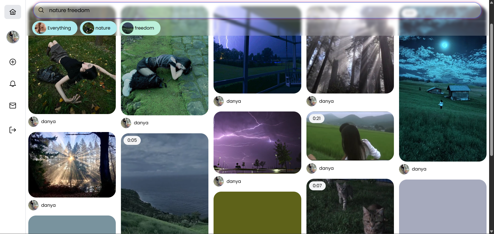
  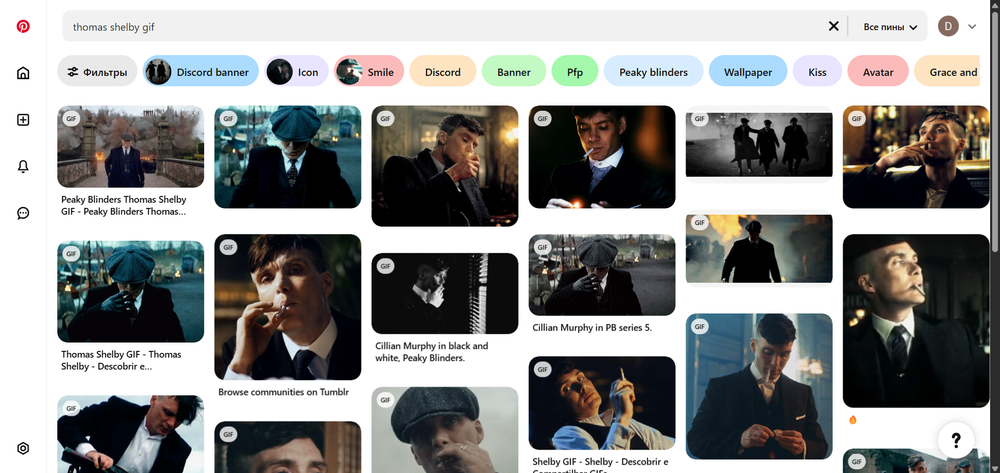

## 🤝 Contribute 🤩
Got ideas? Report bugs, add features, or just join the fun! 🛠️💬

## 📜 License 📝
MIT License – free to use & share! 🔓

## 📬 Contact 📞
- 📧 [dankupr21@gmail.com](mailto:dankupr21@gmail.com)
- 💬 <a href="https://t.me/evalshine" target="_blank" rel="noopener noreferrer">Telegram @evalshine</a>
- 🐙 <a href="https://github.com/shutsuensha" target="_blank" rel="noopener noreferrer">GitHub shutsuensha</a>
